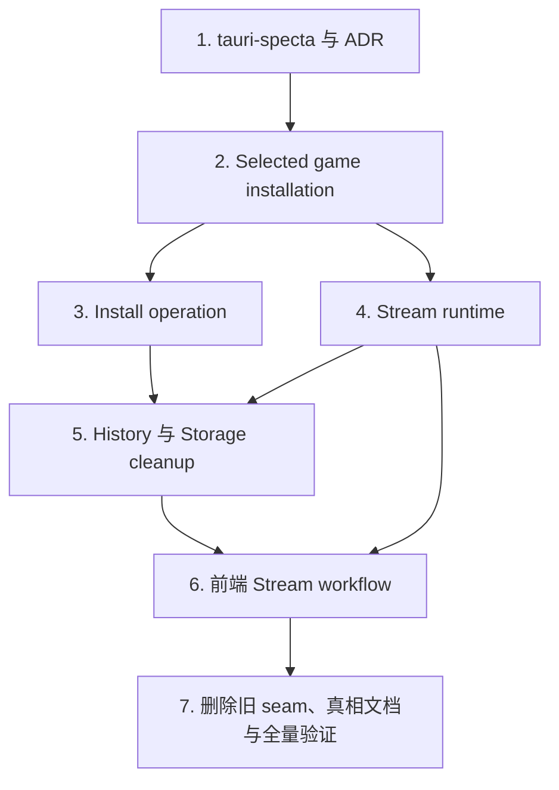

# 架构深化执行计划

## 目的与完成定义

这是一份可由单个 Agent 从头执行到尾的实施计划，覆盖五个已确认的架构候选项：

1. 安装流程收敛为深层操作模块。
2. 前端串流页收敛为可测试的工作流模块。
3. 历史记录与存储清理收敛为领域入口。
4. 后端串流生命周期收敛为并发安全的运行时模块。
5. 以 `tauri-specta` 生成的调用与类型替换手工 Tauri 命令协议。

实施采用 greenfield 内部接口，不兼容旧 Tauri 命令名、参数形状、内部 Rust/TypeScript API 或测试 seam。前后端必须在同一版本中一起迁移，不提供旧协议 fallback。完成后，调用者只依赖领域操作，不再拼装文件路径、安装步骤、串流任务状态或 Tauri 命令字符串。

计划完成必须同时满足：

- 七个阶段依序通过各自的自动化门槛，并各自形成可独立回退的 checkpoint。
- 用户可观察行为和持久化格式保持不变；下文列出的契约均有自动化测试或明确的人工验证项。
- `ts-rs`、手工 `TauriCommandMap`、命令名 artifact 和字段检查清单全部移除；`tauri-specta` 是唯一绑定生成器。
- Install、History、Stream 共享同一个会话级 **Selected game installation**。
- Reset local data 与串流生命周期互斥，不可能在清理过程中被轮询或其它调用重新启动。
- 受影响的真相文档随阶段同步，全部代码引用与 `last-verified` 在最后阶段再做一次全量刷新。
- 本计划在全部完成后移入 `docs/archive/`，不能以“主要代码已写完”代替最终验证和文档收尾。

## 锁定的决策

以下决策已经确认，执行 Agent 不应重新询问或引入并行方案：

- 五项候选全部纳入同一计划，但按依赖顺序拆成可独立验证、可独立提交的阶段。
- 不保留旧 Tauri IPC 兼容层；前后端随每个阶段原子迁移。
- 不自动 fallback 到 `ts-rs`。项目接受 `tauri-specta` RC，并使用精确版本锁定。
- `tauri-specta` 既生成类型，也生成类型安全的命令调用函数；功能模块只保留有语义的 adapter。
- 浏览器 Preview 是第二个真实 adapter，不能通过保留手工命令映射来实现。
- 新建 ADR 记录绑定决策，并明确 supersede ADR-008；历史 ADR 不回写。
- 安装计划/排序模型可以保留，但必须是 Install 模块私有实现；外部调用者和主行为测试不得依赖 `Vec<InstallStep>`。
- 前端 Stream 深模块拥有初始加载、轮询阈值、重启、窗口、裁剪、错误优先级和瞬时消息；React hook 仅作框架 adapter，页面只负责渲染。
- History 是对外深模块；Storage cleanup 保持为 History 内部深模块，保留复杂算法和有价值的内部测试。
- 存储清理 IPC 只有两个领域操作：`preview(scope, preset)` 与 `execute(scope, preset)`；结果按 scope 使用 tagged union 返回。
- 后端 Stream 深模块串行化 ensure/restart/stop/window change，并为 Reset local data 提供全程持有的独占维护协调。
- **Selected game installation** 只存在于当前应用会话，不新增跨重启持久化。
- 各阶段验证成功后自动继续；只有门槛失败、既有契约冲突或发现会改变已锁定产品行为时才停止。

## 不可破坏的产品与持久化契约

内部接口可以重建，但以下边界不属于 greenfield 范围：

- mod-owned SQLite 数据、表结构和现有历史内容不得迁移、删除或改写。
- payload 的所有权、下载内容、落盘位置及校验语义保持不变。
- `.bpp-launch-mode`、Steam launch config、macOS trampoline 和兼容模式的既有语义保持不变。
- OBS overlay 继续绑定 `127.0.0.1:17654`，现有 overlay/asset 路由与可复制 URL 保持不变。
- 安装仍然遇到第一个副作用错误即停止，并在完成后重新探测真实状态。
- Reset local data 继续遵守 ADR-005；串流必须先停且在清理结束前不能重启。
- 窗口关闭、托盘启动/停止/退出、Stream 页面轮询与瞬时反馈的用户体验保持不变。
- 浏览器 Preview 仍能在没有 Tauri runtime 时展示和操作全部现有页面。
- 错误边界继续向 UI 返回可展示的错误；不能用默认成功值吞掉错误。

如果自动化测试证明当前实现已经违反上述契约，可以在对应阶段加强验证并修正；除此之外不得借架构重构改变产品行为。

## 当前代码证据

这些位置是计划的起点；实现过程中若行号移动，以当时代码为准重新引用：

| 候选项 | 当前证据 | 要消除的浅边界 |
| --- | --- | --- |
| Install | `src-tauri/src/services/install/mod.rs:36-104` 先生成再执行计划；`src-tauri/src/services/install/plan.rs:20-55` 的七个 step 直接镜像副作用；`src-tauri/src/services/install/plan.rs:154-367` 主测例绑定精确 step vector | 调用者/测试看到执行结构，而不是完整安装结果 |
| 前端 Stream | `src/features/stream/useStreamPage.ts:42-235` 拥有加载、轮询和所有 action；`src/features/stream/streamViewModel.ts:3-68` 只做静态映射；`src/pages/Stream.tsx:26-201` 同时读取 raw state、action 和 view model | 行为散落在 hook/page，view model 没有隐藏复杂度 |
| History/cleanup | `src-tauri/src/commands/history.rs:14-145` 解析会话路径并暴露四个 cleanup 命令；`src-tauri/src/services/history.rs:13-159` 暴露物理路径并传递参数；`src-tauri/src/history/cleanup.rs:123-525` 才拥有真实算法 | 命令层知道路径、cutoff 和 cleanup plan，领域入口不深 |
| 后端 Stream | `src-tauri/src/stream/state.rs:63-184` 暴露快照、路径和任务 mutation；`src-tauri/src/stream/server.rs:19-177` 分散 start/stop/restart；`src-tauri/src/services/stream_window.rs:7-52` 是单调用者转发层 | 多个调用者可独立修改生命周期，Reset 存在重启竞态 |
| Tauri bindings | `src-tauri/src/commands/registry.rs:3-88` 维护宏和命令名 artifact；`scripts/generate-bindings.mjs:103-165` 拼装生成物；`src/api/tauri.ts:25-144` 手写命令与参数；`src/api/tauri-command-registry.test.ts:9-59` 只完整比较名称，字段清单已不完整 | Rust 命令签名、TS 参数和测试清单重复定义协议 |

依赖基线是 Tauri 2 和 `ts-rs = "12"`，见 `src-tauri/Cargo.toml:21-39`；生成、检查与测试都已通过 npm scripts 串联 bindings，见 `package.json:7-20`。

## 目标模块图与实施顺序



目标依赖方向：

```text
React pages/hooks
  -> feature semantic adapters/workflows
  -> generated command client or Preview adapter
  -> thin Tauri command adapters
  -> Install / History / Stream deep modules
  -> private planning, filesystem, database, process and window details
```

## 全程执行协议

1. 开始前运行 `git status --short`，记录并保护用户已有改动。不得覆盖、还原或夹带无关文件。
2. 在当前分支实施；本计划不要求创建 GitHub Issue、额外工作树或兼容分支。
3. 先执行预检，再按阶段 1–7 顺序工作。阶段内允许红灯到绿灯的小步循环，但门槛未通过不得进入下一阶段。
4. 每阶段只提交本阶段文件，提交前再次检查 `git diff --check`、`git diff --stat` 和 `git status --short`。
5. 使用下文建议的提交标题；若仓库提交规范要求小写或 scope 调整，可调整文字但不能把两个代码阶段合成一个提交。
6. 任何生成文件只能通过生成脚本产生，不得手改。连续运行生成器两次后第二次必须是零 diff。
7. 若 `tauri-specta` 精确锁定版本无法在 Tauri 2 编译，先核对官方版本组合和最小 API 调整；不恢复 `ts-rs`，不建立双生成器。确属上游阻断时停止并报告编译证据。
8. 若某阶段发现产品契约不清楚，优先用现有代码和测试判定。只有会改变“不可破坏契约”时才向用户请求决策。
9. 阶段代码提交后记录其 commit hash。若该阶段使当前 truth doc 失效，立即用代码提交 hash 更新相关内容、行号、`last-verified` 和 `docs/INDEX.md`，形成紧随其后的 docs companion commit，再进入下一阶段。这个二提交组合视为同一个可回退 checkpoint；它沿用仓库“文档提交引用上一代码提交”的现有做法。
10. 最终 truth docs 的 `last-verified` 指向最后一个已验证代码提交，而不是 docs companion commit。
11. 不为覆盖率添加 mock 调用顺序测试或精确源码文本断言；优先测试领域结果、状态转换、外部副作用记录和竞态不变量。

## 预检（不单独提交）

### 操作

1. 运行：

   ```bash
   git status --short
   npm run test
   npm run prebuild-check
   cargo clippy --manifest-path src-tauri/Cargo.toml --all-targets -- -D warnings
   ```

2. 再运行一次 `npm run generate:bindings` 并确认工作树不变化，证明当前生成基线可重复。
3. 若 clippy 存在与当前 HEAD 相同的历史 warning，记录完整基线，最终门槛改为“未增加 warning”；不要借本计划扩张成无关清理。其它基线失败需先保存完整命令和最小错误输出，判断是否由用户已有改动导致。基线问题未隔离前不开始重构。
4. 阅读 ADR-003、ADR-005、ADR-006、ADR-008，以及 `docs/truth/install-reset.md`、`docs/truth/history-stream.md` 中与本计划相关的当前契约。

### 通过门槛

- 基线测试和 prebuild check 成功。
- 生成器幂等。
- 工作树状态已知，且没有未解释的生成物差异。

## 阶段 1：以 `tauri-specta` 建立唯一 IPC 绑定源

### 目标

Rust command 函数及其请求/响应类型成为唯一协议定义；TypeScript 命令调用函数和类型从 Rust 一次生成。浏览器 Preview 作为显式 adapter 使用同一生成类型，不保留手写命令字符串或参数映射。

### 依赖与 ADR

- 精确锁定兼容 Tauri 2 的 RC 组合；实施起点为 `tauri-specta = "=2.0.0-rc.25"`、`specta = "=2.0.0-rc.25"`，并按该 tag 锁定的 `specta-typescript = "0.0.12"` 组合配置 features。先以官方 tag 的 Cargo 配置和编译结果为准，不使用宽松 `^` 范围。
- 版本核对入口：[v2.0.0-rc.25 Cargo.toml](https://github.com/specta-rs/tauri-specta/blob/v2.0.0-rc.25/Cargo.toml) 与 [官方 releases](https://github.com/specta-rs/tauri-specta/releases)。如果文档示例与 tag 源码冲突，以 tag 源码和本仓库编译结果为准。
- 新建 `docs/adr/010-tauri-specta-command-bindings.md`，包含 Context、Decision、Rejected alternatives、Consequences，并声明 `supersedes: 008-command-names-artifact`。
- ADR 明确记录：接受 RC 风险、精确 pin、无 `ts-rs` fallback、Rust command 是唯一 schema、Preview 是第二 adapter、生成失败必须阻止 check/test/build。
- 在 `docs/INDEX.md` 将 ADR-008 状态改为 `superseded-by-010`，登记 ADR-010。

### 实施步骤

1. 在 `src-tauri/Cargo.toml` 替换 `ts-rs`，根据官方 RC API 添加精确锁定的 `tauri-specta`/`specta`/TypeScript exporter 依赖；更新 `Cargo.lock`。
2. 将所有跨 IPC 的 DTO 从 `ts_rs::TS` 切到 `specta::Type`。先用 `rg 'ts_rs|TS\b|export_to' src-tauri` 找全定义，逐个迁移，不能保留双 derive 过渡到阶段结束。
3. 在每个 Tauri command 上添加 Specta command 元数据，并在 `src-tauri/src/commands/registry.rs` 用一个 builder 同时：
   - 收集全部 commands；
   - 注册同一份 commands 给 Tauri handler；
   - 导出 TypeScript 命令调用与类型。
4. 将生成输出收敛到 `src/types/generated/` 下的一套稳定 artifact。推荐单入口 `src/types/generated/commands.ts` 和可选的纯 re-export `index.ts`；不得再按另一套手工命令注册表拼接输出。
5. 改造 `scripts/generate-bindings.mjs`：
   - 调用 Rust exporter 生成到临时目录；
   - 校验预期文件存在且非空；
   - 原子替换仓库生成目录；
   - 规范 LF；
   - 失败时不留下半生成结果；
   - 不解析 Rust 源码、不生成命令名 artifact。
6. 用生成的命令对象建立 native adapter；建立类型兼容的 Preview adapter。运行时选择只发生一次，feature 不得到处判断 `isTauri()`。
7. 迁移现有 feature API 到两类边界：
   - 纯 pass-through 函数直接使用生成调用；
   - 需要错误归一化、组合多个命令或提供领域语义的函数保留为 semantic adapter。
8. 保留 `normalizeBackendError` 等真实语义，但删除 `src/api/tauri.ts` 中的手工 `TauriCommandMap`、手工 payload 定义以及所有命令字符串。
9. 删除 `TAURI_COMMAND_NAMES` 导出、临时命令名 artifact、invalid-field checklist 和只验证命令名集合的测试。新增测试只验证生成器失败行为、幂等性、native/Preview adapter 满足同一 TypeScript interface，以及一个带多字段 payload 的端到端类型/运行调用样例。
10. 运行 `rg 'ts-rs|ts_rs|TauriCommandMap|TAURI_COMMAND_NAMES|tauri-command-names|INVALID_FIELD' .`，对第三方锁文件以外的结果逐项归零或解释。

### 预期文件范围

- 修改：`src-tauri/Cargo.toml`、`Cargo.lock`、`src-tauri/src/commands/registry.rs`、各 command/DTO、`src-tauri/src/lib.rs`、`scripts/generate-bindings.mjs`、`src/api/`、`src/types/generated/`。
- 新增：`docs/adr/010-tauri-specta-command-bindings.md`，必要的 native/Preview adapter 文件和生成器针对性测试。
- 删除：旧 ts-rs 分散生成物、命令名 artifact、手工 command map 及其完整性清单测试。

### 验证

```bash
npm run generate:bindings
npx vitest run scripts/generate-bindings.test.mjs src/api
cargo test --manifest-path src-tauri/Cargo.toml export_bindings
npm run check
npm run prebuild-check
```

如果实际测试文件名不同，使用 `rg --files scripts src/api | rg '(binding|tauri|preview).*test'` 选择最小相关集合。随后连续执行两次 `npm run generate:bindings`，第二次必须零 diff。

### 提交与门槛

- 建议提交：`refactor: generate tauri command bindings with specta`
- 通过门槛：没有残留 `ts-rs`/手工命令协议；Rust 和 TypeScript 编译通过；Preview 测试通过；ADR-010 已登记；生成器可重复。

## 阶段 2：建立会话级 Selected game installation

### 目标

建立一个应用级唯一概念：**Selected game installation**，表示当前会话中 Install、History、Stream 共同针对的 The Bazaar 安装。物理路径是该概念的私有实现细节，History 不再从 Stream state 借路径。

### 领域规则

- 生命周期：应用启动到退出；不写入新配置、不新增数据库或磁盘标记。
- 选择优先级：本次操作显式提供且通过现有接受规则的路径 > 会话中已选择的安装 > 启动时检测到的安装 > 现有 fallback 探测。
- 显式选择成功后提升为会话选择；无效显式路径不能覆盖已有有效选择。
- 安装、历史和串流只能通过该模块解析当前安装，不能各自保存第二份 session path。
- 路径规范化、Steam 安装探测和“可接受安装”的判断继续使用现有规则；本阶段不改变支持平台或目录结构。

### 实施步骤

1. 新建默认路径 `src-tauri/src/services/selected_game_installation.rs`，定义 `SelectedGameInstallationState` 和最小领域接口：解析当前安装、接受显式选择、读取快照。不要公开内部 mutex、raw option mutation 或缓存字段。
2. 把 `src-tauri/src/services/game_path.rs` 中可复用的检测/接受逻辑留作该深模块的私有协作者；调用者不能自行重演优先级。
3. 在 `src-tauri/src/lib.rs` 创建并 manage 唯一 state；移除其它模块对同一 session path 的所有权。
4. 先迁移现有 command/service 调用到该 state，保持命令行为；Install、History、Stream 的进一步深化留给后续阶段。
5. 添加表驱动测试覆盖四级优先级、无效显式路径、选择更新、无选择错误和会话重建后不持久化。
6. 实现和测试代码提交后，立刻在本阶段的 docs companion commit 中把 **Selected game installation** 加入 `CONTEXT.md` glossary，把 `last-verified` 指向刚完成的代码提交，并引用实际定义/管理位置；不要在代码存在前写入该术语，也不要写未来阶段尚未实现的调用关系。

### 验证

```bash
cargo test --manifest-path src-tauri/Cargo.toml selected_game_installation
cargo test --manifest-path src-tauri/Cargo.toml game_path
npm run check
```

### 提交与门槛

- 建议提交：`refactor: centralize the selected game installation`
- 通过门槛：应用只管理一份 selected installation；三类现有调用都可通过它解析路径；没有新持久化；优先级测试通过；`CONTEXT.md` 只陈述已经实现的事实。

## 阶段 3：把 Install 收敛为完整操作

### 目标

Tauri command 只发起一次完整 Install 操作并接收领域结果。Install 模块内部负责收集事实、产生私有计划、按顺序执行、首错停止、重新探测并返回最终状态。

### 目标边界

- 对外：类似 `install(request) -> Result<InstallOutcome, InstallError>` 的窄接口；具体命名服从 Rust 现有风格。
- 对内：私有 facts、plan、step、effect runner；生产 effect adapter 执行真实文件/下载/launch-mode 工作，测试 recorder 记录实际发生的 effect。
- `InstallStep` 和 `Vec<InstallStep>` 不得出现在 Tauri command、其它 service 的签名或主行为测试中。
- payload 和 trampoline 的低层高风险算法继续保留针对性单元测试，不要为了统一而塞入 orchestrator mock。

### 实施步骤

1. 在 `src-tauri/src/services/install/` 建立 operation 入口；`plan.rs` 可以保留但改为私有，也可合并进 operation，前提是模块外无法观察 step vector。
2. 将 `src-tauri/src/services/install/mod.rs:36-104` 的 gather/plan/execute/refresh 变成一个不可被调用者拆开的事务式流程。
3. 由 operation 使用 Selected game installation；显式安装请求只有在通过既有接受规则后才更新会话选择。
4. 把真实副作用封装在模块私有 effect 接口中。只实现两个 adapter：生产 adapter 与测试 recorder；不要为每个 step 建一个公共 service。
5. 保留所有现有顺序约束，包括 payload、loader/BepInEx、config、launch mode、trampoline 等；以当前代码和 ADR-003/006 为准建立顺序不变量。
6. 错误发生时立即停止后续 effect，并保留足够上下文供 UI 展示；成功后重新从磁盘探测状态，不能根据“计划已执行”合成成功。
7. 将旧的精确 `Vec<InstallStep>` 测试替换为 operation 级测试：给定 facts，断言 outcome、实际 effect 记录、首错截断和最终 refresh。只有真正复杂且稳定的私有 planner 不变量可保留少量单元测试。
8. 迁移 install/reset command 和其它调用者，只依赖 operation；删除不再需要的公共 re-export。

### 必测行为

- fresh install、repair/reinstall、已安装无操作、payload 缺失/变化。
- 各 launch mode 下的 effect 顺序，尤其 macOS trampoline 强制/opt-in 分支。
- 任意中间 effect 失败后不执行后续 effect。
- refresh 能发现实际落盘与期望不同，并返回真实状态。
- 无效显式路径不污染 Selected game installation。

### 验证

```bash
cargo test --manifest-path src-tauri/Cargo.toml services::install
cargo test --manifest-path src-tauri/Cargo.toml services::bepinex
cargo test --manifest-path src-tauri/Cargo.toml trampoline
npm run check
```

### 提交与门槛

- 建议提交：`refactor: encapsulate the complete install operation`
- 通过门槛：外部不存在 step vector 依赖；operation 行为矩阵覆盖旧分支；payload/trampoline 测试保持；安装命令只调用一个领域操作。

## 阶段 4：把后端 Stream 收敛为并发安全运行时

### 目标

所有串流生命周期和窗口变更由唯一 `StreamRuntime` 串行化。调用者可以表达 ensure、restart、stop、window change 和 exclusive maintenance，但不能读写 task handle、session path 或内部状态字段。

### 并发不变量

- 同一时刻最多一个 overlay server task 和一个受管窗口状态。
- ensure 幂等；并发 ensure 不能创建两个 task。
- restart 在同一生命周期锁内完成 stop + start，中间不能被另一个 ensure 插入。
- stop 返回时 server task 已不可继续服务，状态快照与实际 task 一致。
- window change 与 start/stop 串行，不能作用于已替换的窗口/服务实例。
- Reset local data 获得 exclusive maintenance 后先停流，并在清理 closure/guard 完成前一直阻止 ensure/restart/window change；不允许“先 stop、释放锁、再删除”。
- 生产绑定地址、端口和路由保持不变。

### 实施步骤

1. 将 `src-tauri/src/stream/state.rs`、`server.rs` 和单调用者 `services/stream_window.rs` 的职责收进 `StreamRuntime` 深模块；文件可以继续拆分，但 visibility 默认私有或 `pub(crate)`。
2. 使用 async-aware 生命周期门（例如 `tokio::sync::Mutex`）串行化可能跨 `await` 的操作；不要在 `await` 期间持有 `std::sync::Mutex` guard。
3. 只暴露不可变领域 snapshot，不暴露 task handle、raw path setters 或 start/stop mutation 序列。
4. 运行时通过 Selected game installation 获取当前安装，并在启动/重启时捕获一致的 installation snapshot。
5. 为 Reset 提供一个不会泄露锁细节的 exclusive maintenance 操作。可以是运行时执行异步 closure，或私有 RAII guard；无论实现形式，测试必须证明清理期间 ensure 被阻塞且清理结束后状态为 stopped。
6. 迁移 `src-tauri/src/lib.rs`、tray handler、stream commands 和 reset service；删除调用者直接组合 `stop_stream`、`start_stream` 或修改 state 的路径。
7. 将 window change 合并进运行时；删除 `services/stream_window.rs` 纯转发层，除非它在重构后拥有独立窗口策略。
8. 为 task 创建/关闭、端口绑定和窗口动作使用模块私有生产 adapter 与可控测试 adapter，避免测试占用固定生产端口。

### 必测行为

- 并发 ensure 只启动一次。
- start → snapshot → window change → restart → stop 的状态转换。
- start/bind 失败不会留下“running”假状态或悬挂 task。
- exclusive reset 已进入后，ensure/restart 被阻塞；reset 完成后不会自动恢复串流。
- 托盘 stop/quit 与窗口关闭规则不变。
- `127.0.0.1:17654` 和现有 overlay/asset routes 的 production 配置不变。

### 验证

```bash
cargo test --manifest-path src-tauri/Cargo.toml stream::
cargo test --manifest-path src-tauri/Cargo.toml stream_runtime
cargo test --manifest-path src-tauri/Cargo.toml reset
npm run check
```

### 提交与门槛

- 建议提交：`refactor: serialize the stream runtime lifecycle`
- 通过门槛：所有生命周期 mutation 只有一个入口；Reset 全程持有排他协调；竞态测试稳定重复通过；生产网络契约不变。

## 阶段 5：建立 History 深入口并内聚 Storage cleanup

### 目标

History 对外提供围绕 Selected game installation 的记录查询、详情、reveal/delete 和存储清理操作。数据库路径、视频/截图目录、cutoff、cleanup plan 和 repository 连接是私有实现。

### 新 cleanup 协议

- `StorageCleanupScope`：至少 `Screenshots` 与 `RunData` 两个 variant。
- `StorageCleanupPreset`：表达现有 UI 可选保留期/策略，不让调用者换算 raw cutoff timestamp。
- `preview(scope, preset)`：返回按 scope tagged 的 preview，其中包含 UI 真正需要的数量/大小等信息。
- `execute(scope, preset)`：返回按 scope tagged 的 execution result。
- tagged union 使用 Serde + Specta 生成，前端必须 exhaustively narrow scope；不保留四个旧命令 wrapper。

### 实施步骤

1. 将 `src-tauri/src/services/history.rs` 改造成 History facade，或在 `src-tauri/src/history/` 内建立 facade 并让 service 只保留薄装配；对外只能看见领域请求/结果。
2. 通过 Selected game installation 在 facade 内构造私有 `HistoryPaths`；移除 command 层从 Stream state 获取 session path 和传递 database/game/video dirs 的逻辑。
3. 将 `src-tauri/src/history/mod.rs` 的公共模块收窄；repository、cleanup plan 和 filesystem helpers 默认私有或 `pub(crate)`。
4. 保留 `repo.rs` 与 `cleanup.rs` 中复杂 SQL、文件扫描、防越界和 plan/execute 算法及其有价值的测试；不把这些算法塞进 command 层。
5. 把四个 cleanup commands 合成两个 greenfield commands，并让阶段 1 的生成客户端产生新签名。删除旧命令名，不做 alias/fallback。
6. 迁移 `src/features/history/historyApi.ts`、`useStorageCleanup.ts` 和 `StorageCleanupCard.tsx`：UI 只提交 scope + preset 并渲染 tagged result，不计算 cutoff、不选择命令名。
7. Preview adapter 实现同一个 History/cleanup 语义接口，并覆盖两个 scope。
8. 增加 facade 级 tempfile 测试：从 Selected installation 构造路径，执行 list/detail/reveal/delete/preview/execute，并验证数据库/文件结果。不要只断言 repo mock 调用顺序。

### 不变量

- 无选中安装时返回明确领域错误，不借用 Stream 是否运行来决定路径。
- SQLite schema 和已有数据保持原样。
- cleanup preview 与 execute 对同一 scope/preset 使用同一选择规则。
- 只删除当前安装受管理目录中的目标；既有 path safety 测试不得削弱。
- 旧 History 页面展示、删除确认、reveal 和存储清理反馈保持不变。

### 验证

```bash
cargo test --manifest-path src-tauri/Cargo.toml history::
npx vitest run src/features/history
npm run generate:bindings
npm run check
```

### 提交与门槛

- 建议提交：`refactor: deepen history and storage cleanup boundaries`
- 通过门槛：command 层不见 raw paths/cutoff/plan；cleanup 只有 preview/execute 两个命令；前端 exhaustively 处理 tagged result；现有数据库与 path safety 测试通过。

## 阶段 6：把前端 Stream 收敛为工作流模块

### 目标

建立框架无关的 Stream workflow/state machine。它拥有所有可观察页面行为；React hook 只负责订阅、生命周期挂接和把 intent 暴露给页面，`Stream.tsx` 只从一个 snapshot 渲染。

### 工作流边界

注入以下 ports，而不是在状态机内直接导入全局 API：

- semantic Stream command adapter（native 或 Preview）；
- timer/scheduler；
- clipboard；
- opener。

工作流对外只暴露：

- 单一 `StreamPageSnapshot`：加载/运行状态、派生文案、按钮可用性、窗口/裁剪值、优先错误和瞬时消息；
- 用户 intents：restart、stop/start（按现有 UI）、window update、crop update、copy URL、open URL 等；
- subscribe/start/dispose 或等价的最小生命周期接口。

### 实施步骤

1. 在 `src/features/stream/` 新建默认入口 `streamWorkflow.ts`；使用显式 reducer/state machine 或小型 class 均可，不新增第三方状态机依赖。
2. 把 `useStreamPage.ts:42-235` 的初始并行加载、轮询阈值、action busy 状态、重启后刷新、窗口/裁剪更新、错误选择和瞬时消息移动到 workflow。
3. 定义错误优先级和消息过期规则为单一纯逻辑，避免页面同时解释 raw error 与 action error。
4. 防止异步竞态：dispose 后不得 set state；旧 poll/restart response 不得覆盖更新 epoch；同一互斥 action 不得并发发起。
5. 将 `useStreamPage.ts` 缩成 React adapter；它不能重新实现 timer、错误映射或 action 流程。
6. 将 `Stream.tsx` 改为只读取 snapshot 并调用 intents；删除 raw `status` + `action` + `viewModel` 三套来源。
7. 删除 `streamViewModel.ts` 及只验证静态字段映射的测试；真正有复用价值的纯派生函数作为 workflow 私有 helper 测试。
8. 用 fake scheduler 和 fake semantic adapters 做行为测试，不 mock Tauri command name。

### 必测行为矩阵

- 初始并行请求全部成功、部分失败、全部失败；错误优先级稳定。
- 轮询达到当前阈值才更新，并在 dispose 后停止。
- restart 成功后刷新；restart 失败保留旧可用状态并显示 action error。
- 慢 poll 与 restart response 交错时，旧 response 不覆盖新 epoch。
- window size/position clamp 与 crop 更新使用现有范围和反馈。
- copy/open 成功和失败产生现有瞬时消息，消息按 scheduler 清除。
- action busy 期间禁用冲突 intent，不重复提交。
- Preview 与 native adapter 共享同一 workflow 测试契约。

### 验证

```bash
npx vitest run src/features/stream
npm run check
npm run test:unit
```

若仓库中已有 `src/pages/Stream.test.tsx`，再单独运行该文件。不要为覆盖率机械新增页面快照测试；以 workflow 行为测试和现有页面测试为准。

### 提交与门槛

- 建议提交：`refactor: encapsulate the stream page workflow`
- 通过门槛：页面只有一个 snapshot；hook 仅作 adapter；轮询、异步竞态、错误和瞬时消息都有确定性测试；旧 shallow view model 已删除。

## 阶段 7：删除旧 seam、更新真相并全量验证

### 代码与依赖清理

1. 对下列模式全库搜索并逐项处理：

   ```bash
   rg 'ts-rs|ts_rs|TauriCommandMap|TAURI_COMMAND_NAMES|tauri-command-names'
   rg 'InstallStep|HistoryPaths|StreamRuntimeState|streamViewModel'
   rg 'preview_screenshot_cleanup|execute_screenshot_cleanup|preview_run_cleanup|execute_run_cleanup'
   ```

2. 删除纯 pass-through service/API、无调用 re-export、过时测试 fixture 和旧生成文件。保留项必须在代码中确实承担独立策略，而不是为了文件结构存在。
3. 运行 `cargo clippy --manifest-path src-tauri/Cargo.toml --all-targets -- -D warnings`；若预检已有历史 warning，则与保存的基线比较并确保本次未增加 warning。修复本次重构引入的 warning，不顺手清理无关历史问题。
4. 确认 `Cargo.lock` 不再包含 `ts-rs`（除非第三方传递依赖；若存在需在交付说明解释，源码不得直接使用）。
5. 如果上述步骤产生代码或测试 diff，在更新 truth docs 前先完成本阶段代码验证并提交。建议提交：`refactor: remove superseded architecture seams`。这个 hash 是最终文档验证的目标。

### 真相文档更新

以最终代码为准，更新以下文档的架构描述和精确 `file:line` 引用：

- `CONTEXT.md`：保留并校正 **Selected game installation** glossary 与入口映射。
- `docs/truth/architecture.md`：生成式 IPC、命令 adapter、深模块依赖方向。
- `docs/truth/frontend.md`：native/Preview adapters 与 Stream workflow。
- `docs/truth/install-reset.md`：Install operation 与 exclusive reset coordination。
- `docs/truth/history-stream.md`：History facade、cleanup scope 协议和 Stream runtime。
- `docs/truth/verification.md`：bindings 生成、相关行为测试和验证入口。
- `docs/INDEX.md`：ADR-008/010 状态、truth docs hash、计划归档条目。

操作规则：先完成最后一个代码提交并取得 hash；如果本阶段没有代码 diff，则使用阶段 6 的代码提交 hash。再把上述 truth docs 的 `last-verified` 更新为该 hash。每条事实重新对照代码，不能复制本计划中的旧行号。

### 全量自动验证

```bash
npm run generate:bindings
git diff --exit-code -- src/types/generated
npm run format:check
npm run check
npm run test
npm run prebuild-check
cargo clippy --manifest-path src-tauri/Cargo.toml --all-targets -- -D warnings
git diff --check
```

`./build.sh --prod` 只在本次实际改变平台 bundling/release packaging 时运行；单纯命令注册、依赖与内部架构重构不以生产打包作为默认门槛。

### 人工 smoke

1. 运行 `npm run dev -- --host 127.0.0.1 --port 14207`，在 `http://127.0.0.1:14207/` 验证 Browser Preview：Install、History、Storage cleanup、Stream 页面均可展示和执行 Preview 行为。
2. 在可用的 Tauri 开发环境验证：
   - 安装/重新安装完成后状态来自重新探测；
   - History list/detail/reveal/delete 与两个 cleanup scope；
   - overlay 启动、复制 URL、窗口/裁剪操作、restart、stop；
   - Reset local data 在串流运行时先停流且不会自动重启；
   - 托盘 stop/quit 与窗口关闭行为。
3. 无法在当前机器验证的 macOS/Windows 实机项目继续保留在 `docs/plans/manual-validation.md`，不得把“未验证”改写为 truth。

### 计划归档与最终提交

1. 所有验证通过后，将本文件移动到 `docs/archive/2026-07-18-architecture-deepening.md`。
2. frontmatter 改为 `status: implemented`，`last-verified` 指向最终已验证代码提交；在顶部追加简短结果记录，列出阶段 commit hashes 与任何明确未完成的实机验证。
3. 从 `docs/INDEX.md` 的 active plan 行移除原路径并登记 archive 路径。
4. 建议最终 docs companion commit：`docs: record the architecture deepening result`

### 最终通过门槛

- 全量命令全部成功且 bindings 二次生成零 diff。
- 五个目标深模块边界均能从代码和测试直接证明。
- 没有自动 fallback、旧 IPC alias 或双绑定生成器。
- 所有 truth docs 引用与最终代码一致。
- 工作树只包含预期变更，计划已归档，未完成实机验证仍明确列在 manual validation backlog。

## 停止条件与交付报告

只在以下情况停止自动继续：

- 阶段验证连续失败且最小复现显示需要改变已锁定契约；
- `tauri-specta` 精确版本与当前 Tauri 2 存在无法在仓库内解决的上游编译阻断；
- 发现用户未授权的数据迁移、平台发布变更或破坏性删除是完成阶段的必要条件；
- 用户已有改动与计划目标文件发生无法安全合并的直接冲突。

停止时报告：失败阶段、最后成功 checkpoint、精确命令、最小错误输出、已排除原因和需要用户决定的唯一问题。成功时报告：各阶段代码与 docs companion commits、测试命令结果、truth-doc verification hash、残留人工验证项，以及确认没有兼容/fallback 层。
