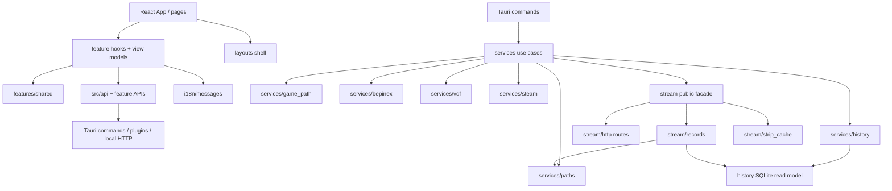

# bazaarplusplus-installer 架构改进方案

> 日期：2026-06-05
> 范围：`src-tauri/src/`、`src/`、`scripts/`、`docs/`
> 目标：把只读审计结论收敛成可执行的改进计划。代码是事实来源；每个进入计划的议题都保留 `file:line` 证据。
>
> **历史记录（点状快照，2026-06-05）**：这是当时的改进计划，不是实时缺陷清单。其后多个 P0 已落地（如 P0-1 支持菜单、P0-2 macOS chmod、P0-3 安装/卸载改 async、P0-4 应用内自动更新、P0-8 overlay 设置降级、P0-9 路径穿越/CORS 收窄），第 2 章部分「现状」代码事实已不再成立。当前实现的权威描述以 `docs/architecture.md` 与代码为准，引用前请按当前代码重新取证。

## 0. 方案原则

- 先修用户可感知故障，再做结构收敛，最后做低风险清理。
- 不把“机械上存在”自动等同于“必须整改”。例如 `services` 和 `stream` 互相引用是事实，但仅在触碰相关模块时顺手收敛，不单独立项。
- 不删除兼容性兜底，除非能证明真实历史库和第三方写入都不依赖它。
- 涉及 DTO、命令签名、生成绑定、Tauri 配置、资源包的改动，必须按本仓 verification 规则做对应检查。

## 1. 改进后的目标结构

做完 P0/P1/P2 后，目标是**明显更高内聚、低耦合**，但不追求“洁癖式分层”。判断标准是：

- 同一业务规则只有一个 owner，例如游戏目录定位、BPP 数据路径、strip 缓存键。
- 上层编排依赖下层能力，下层模块不反向知道 UI、Tauri command 或其它 feature 的细节。
- 前端 feature 之间不横向调用；共享副作用放到 shared/api 层并显式命名。
- 后端 command 层只做 IPC 参数/返回值，不做重 IO、不拼业务路径、不吞错误语义。

### 1.1 目标依赖方向

这张图表达的不是“只能这样 import”，而是 owner 边界：

- `commands` 可以依赖 `services`，但不直接拼路径、不直接操作 SQLite、不执行长阻塞任务。
- `services` 负责用例编排，例如安装、卸载、reset、历史路径解析、stream 会话生命周期。
- `history` 只负责 SQLite schema/read model，不负责找游戏目录。
- `stream` 只负责本地 HTTP、overlay 设置、截图路由、strip 缓存，不再复制游戏目录定位规则。
- `features/history` 不再直接 import `features/stream`；需要 HTTP base URL 时调用 shared/api 层的 stream session 能力。

### 1.2 后端模块职责

| 模块 | 改进后做什么 | 不再做什么 |
|---|---|---|
| `src-tauri/src/commands/` | Tauri IPC 薄壳：解析参数、调用 service、返回 DTO；重任务用 async command 交给 service/blocking task | 不拼业务路径、不直接读写 SQLite/zip、不做安装流程决策 |
| `src-tauri/src/services/install/` | 安装、卸载、reset、启动游戏的用例编排；负责停 stream 后再 reset；负责把后端错误 code 映射成稳定契约 | 不直接把中文/英文用户文案塞进 DTO |
| `src-tauri/src/services/bepinex/` | payload 文件操作：校验游戏目录、preserve cfg、解压、chmod、卸载、清理 BPP 数据目录 | 不知道 stream runtime，也不负责前端状态刷新 |
| `src-tauri/src/services/game_path.rs` | 唯一游戏目录定位器：候选路径、有效性谓词、db/game_path 返回结构、跨平台默认路径策略 | 不让 detect、history、stream 各自复制兜底扫描 |
| `src-tauri/src/services/paths.rs` | BPP 数据目录、db、截图目录、overlay cache 等路径拼接单一来源 | 不把 `"BazaarPlusPlusV4"` 和 db 文件名散落在各模块 |
| `src-tauri/src/services/history.rs` | history 用例门面：解析路径、调用 repo、reveal/delete 编排 | 不把 SQL 细节暴露到 command；不创建空 db |
| `src-tauri/src/history/` | SQLite read model、DTO mapping、文件 reveal/delete 的 repository 级操作 | 不负责探测 Steam 或游戏目录 |
| `src-tauri/src/stream/` | 本地 overlay HTTP 服务、overlay 设置、record API、图片/strip/cache、状态事件 | 不做第二套 game path fallback；不把安全策略散在 handler 内 |
| `src-tauri/src/services/vdf/` | Steam launch options 解析、注入、备份、验证、回滚 | 不负责 chmod；chmod 是 payload 安装的一部分 |
| `src-tauri/src/services/steam.rs` | Steam 进程探测、退出请求、launch-option 支持判断 | 不保留运行时不可达的旧 command-era DTO/流程 |
| `src-tauri/src/services/startup.rs` | 一次性启动上下文缓存：bundled version、.NET、Steam/game path 初始探测 | 不让首个前端命令独占承担全部冷启动成本 |

### 1.3 前端模块职责

| 模块 | 改进后做什么 | 不再做什么 |
|---|---|---|
| `src/api/` | Tauri command、Tauri plugin、本地 HTTP 的统一边界；维护命令入参/出参契约 | 不让 feature 随意直接 import `@tauri-apps/*` |
| `src/features/shared/` | 通用 hook、错误解析、共享 stream session 能力、跨 feature 的小型基础设施 | 不放具体页面业务文案和页面状态 |
| `src/features/install/` | 安装页状态机、确认弹窗动作、安装/reset/uninstall 交互 | 不直接解析后端机器错误字符串以外的业务路径 |
| `src/features/stream/` | Stream 页 view model、overlay 设置、OBS URL、窗口偏移控制 | 不被 history feature 直接 import |
| `src/features/history/` | 历史列表/详情的数据加载、删除/reveal 操作、截图 preview URL 组合 | 不启动 stream 的隐式副作用；改用 shared/api 层显式能力 |
| `src/features/about/` | app bootstrap、credits/licenses、updater 产品路径 | 不手抄 `app-bootstrap.json` |
| `src/layouts/` | Shell、Header、导航、支持/支付入口等纯 UI 壳层 | 不承载业务 use case |
| `src/i18n/` | 所有用户可见文案和错误 code 的本地化 | 不让 Rust 中文/英文 message 直出 UI |

### 1.4 具体会得到的改进

| 改进项 | 高内聚体现 | 低耦合体现 |
|---|---|---|
| 统一游戏目录定位器 | fallback 候选、谓词、返回结构都在 `services/game_path` | stream/history/detect 不再互相复制扫描逻辑 |
| 路径基础设施 | BPP 数据目录和 db/screenshot/cache 路径由一个模块负责 | 改目录名或 schema 路径时不需要扫全仓字符串 |
| 安装 use case 编排 | install/reset/uninstall 的顺序、回滚、stream stop 都在 install service | `bepinex` 只做文件 payload，不知道 stream/UI |
| stream HTTP 内聚 | strip cache、安全过滤、overlay 设置都归 stream 自己维护 | history 只给 screenshot id 或 strip path，不关心 HTTP 路由细节 |
| 前端 shared/api 会话层 | stream session 这个副作用被显式命名 | history 不再横向依赖 stream feature |
| i18n/error code | 用户文案集中在 `messages.ts` | 后端只承诺稳定 code，不绑定语言和 UI 展示 |

## 2. 当前关键事实

| 主题 | 代码事实 | 影响 |
|---|---|---|
| 支持菜单点击失效 | 外点关闭监听检查 `[data-dropdown]`（`src/layouts/GlobalShell.tsx:36-39`），B 站菜单容器有标记（`src/layouts/ShellHeader.tsx:426`），支持菜单容器没有（`src/layouts/ShellHeader.tsx:524-541`） | 支持菜单内鼠标点击会先卸载 DOM，再丢失 click |
| 安装/卸载重操作在同步命令里执行 | `install_mod`/`uninstall_mod` 是同步 Tauri command（`src-tauri/src/commands/install.rs:38-43,57-62`）；安装读取并解压 zip（`src-tauri/src/services/bepinex/mod.rs:78-92`）；Steam 退出等待为 60 次 500ms（`src-tauri/src/services/steam.rs:10-12,71-79`） | 安装、卸载期间 UI 容易长时间无响应 |
| macOS 安装成功可能不等于 mod 可运行 | `patch_launch_options` 在不支持启动项更新时提前返回（`src-tauri/src/services/vdf/launch_options.rs:220-231`），`run_bepinex.sh` chmod 在早退之后（`src-tauri/src/services/vdf/launch_options.rs:236-240`）；zip 解压用 `std::fs::write`（`src-tauri/src/services/bepinex/zip_archive.rs:56-59`） | Steam userdata 缺失时，安装可成功但脚本不可执行、启动项也未写 |
| 安装缺少文件级回滚 | 安装前先删除旧 payload（`src-tauri/src/services/bepinex/payload.rs:173-176`），随后直接解压到游戏目录（`src-tauri/src/services/bepinex/mod.rs:78-92`），只 preserve/restore 单个 cfg（`src-tauri/src/services/bepinex/mod.rs:70-71,98-110`） | 解压中途失败会留下半安装状态 |
| updater 只有检查没有安装路径 | updater 插件注册（`src-tauri/src/lib.rs:32-34`），capability 授权（`src-tauri/capabilities/default.json:6-19`），前端只调用 `check()`（`src/features/about/aboutApi.ts:50-53`） | 用户看到“有更新”，但应用内没有下载、安装、重启路径 |
| strip 图片接口重复 IO | `/images/{id}/strip` 先整读源图（`src-tauri/src/stream/http.rs:224-235`），响应 `Cache-Control: no-store`（`src-tauri/src/stream/http.rs:241-248`），列表 `` 未 lazy（`src/pages/History.tsx:117-123`） | 历史页每次进入会重复读源图和重传 strip |
| 游戏目录定位分散 | detect 兜底只看目录存在（`src-tauri/src/services/detect/steam.rs:245-252`），history/stream 兜底要求 db 存在（`src-tauri/src/services/game_path.rs:42-47`、`src-tauri/src/stream/records/locator.rs:32-39`），有效游戏路径谓词另在 `is_valid_game_path`（`src-tauri/src/services/detect/game.rs:30-35`） | 同一机器状态可能被不同入口判成不同结果 |
| stream db 兜底是“半工作” | `find_database_path_anywhere` 只返回 db 路径（`src-tauri/src/stream/records/locator.rs:29-39`），repository 无 `game_path` 时相对截图无法解析（`src-tauri/src/stream/records/mod.rs:73-82`、`src-tauri/src/stream/records/image.rs:19-27`） | 兜底能读文字记录，但截图条带静默缺失 |
| reset 错误码未被前端消费 | 后端返回稳定前缀（`src-tauri/src/services/bepinex/mod.rs:13-18,53-62`），前端 async action 只转普通 error message（`src/features/shared/useAsyncAction.ts:21-27`） | 用户会看到机器码或控制字符分隔的路径串 |
| stream 状态不订阅外部停服 | Stream 页只在挂载时 refresh（`src/features/stream/useStreamPage.ts:61-63`），托盘停服直接调用 `server::stop`（`src-tauri/src/tray.rs:40-45`） | 页面会长期显示已失效的 OBS URL |
| overlay 设置读写策略矛盾 | `load()` 遇版本不符返回 Err（`src-tauri/src/stream/overlay_settings.rs:93-110`），`save()` 遇同类错误走 default（`src-tauri/src/stream/overlay_settings.rs:119-136`） | 老版本或损坏设置会让直播页进入 error 态 |
| 本地 HTTP 图片路径可穿越 | overlay 图片路径归一化保留 `..`（`src-tauri/src/stream/records/image.rs:30-39`），HTTP server CORS Any（`src-tauri/src/stream/http.rs:68-77`） | DB 内容异常时，本机网页可经 loopback 读取数据目录外文件 |
| `compute_startup` 触发点不只前端命令 | setup 会异步启动 stream（`src-tauri/src/lib.rs:39-46`），stream start 会调用 `resolve_game_path`（`src-tauri/src/stream/server.rs:43-48`），进而可能初始化 `OnceLock`（`src-tauri/src/services/detect/mod.rs:43-45`、`src-tauri/src/services/startup.rs:31-41`） | 启动卡顿诊断要同时考虑后台 stream start 和首个命令等待 |

## 3. P0：先修用户可感知和发布前风险

### P0-1 修复支持菜单外点识别

- 修法：给 `ShellSupportMenu` 外层容器补 `data-dropdown`；若要调整事件类型，只做小步改动并确认 Bilibili 菜单仍可打开、关闭、点击。
- 文件：`src/layouts/ShellHeader.tsx`，必要时 `src/layouts/GlobalShell.tsx`。
- 验证：`npm run check`；手测微信支付、Ko-fi、支持者列表、toggle 再点关闭。

### P0-2 解耦 macOS `run_bepinex.sh` 可执行位

- 修法：把 `run_bepinex.sh` chmod 从 `patch_launch_options` 内移到 macOS 安装解压成功后的无条件步骤；启动项写入失败仍可正确暴露 warning，但脚本权限不再依赖 Steam userdata。
- 文件：`src-tauri/src/services/bepinex/mod.rs`、`src-tauri/src/services/vdf/launch_options.rs`。
- 风险：macOS 文件权限和签名行为要实机确认。
- 验证：`cargo test`；macOS 手测 Steam userdata 缺失或不可写时，脚本权限仍正确。

### P0-3 安装/卸载命令改成 async 隔离阻塞工作

- 修法：`install_mod`、`uninstall_mod` 改 `async` command，重 IO、解压、Steam 等待放入 `tauri::async_runtime::spawn_blocking`。命令名、前端入参、返回 DTO 不变。
- 文件：`src-tauri/src/commands/install.rs`、`src-tauri/src/services/install/mod.rs`、`src-tauri/src/services/bepinex/mod.rs`、`src-tauri/src/services/steam.rs`。
- 风险：`tauri::State` 生命周期不能直接跨 blocking closure，需要在 command 层先 clone/取出需要的数据。
- 验证：`cargo test`；`npm run check`；手测安装、卸载期间窗口仍响应。

### P0-4 明确 updater 产品路径

二选一，发布前必须定案：

| 方向 | 修法 | 验证 |
|---|---|---|
| 应用内更新 | 在 About 页提供 `downloadAndInstall` 和 relaunch 流程，处理下载中、失败、重启确认 | Tauri updater smoke，`npm run check`，发布前 `npm run prebuild-check` |
| 手动更新 | UI 文案改为“检测到新版本，请前往下载页”，去掉或收窄 `updater:default` 权限 | `npm run check`，确认 capability 与产品行为一致 |

### P0-5 reset 错误码落地到前端 i18n

- 修法：前端识别 `bpp_data_reset_blocked_by_game` 和 `bpp_data_reset_partial_failure:` 前缀。部分失败路径按 `\u{1f}` 拆分后展示简洁中文/英文提示，完整路径只在详情或调试信息里出现。
- 文件：`src/features/install/useInstallPage.ts`、`src/features/shared/errors.ts`、`src/i18n/messages.ts`。
- 验证：`npm run check`；手测游戏运行中点重置、本地构造部分删除失败。

### P0-6 修复并发 action 状态和安装失败弹窗

- 修法：`useAsyncAction.run` 单飞，`finally` 只清理自己发起的 action，并返回成功/失败 boolean；`Install.tsx` 只在 install 成功后关闭确认弹窗。
- 文件：`src/features/shared/useAsyncAction.ts`、`src/pages/Install.tsx`、受影响页面 hook。
- 验证：`npm run check`；补一个 focused vitest 覆盖并发 action 或失败返回语义。

### P0-7 stream 状态事件化或轮询刷新

- 修法：`server::start/stop` emit 状态事件，前端 `listen` 订阅；如果事件接入成本高，先加轻量轮询作为保守修复。
- 文件：`src-tauri/src/stream/server.rs`、`src-tauri/src/tray.rs`、`src/features/stream/useStreamPage.ts`。
- 验证：`npm run check`；手测 Stream 页打开时从托盘停服，页面状态和按钮立即或按轮询周期更新。

### P0-8 overlay 设置损坏时降级默认值

- 修法：统一 load/save 策略。推荐 `load()` 对版本不符或 parse 失败返回默认设置并记录日志；前端仍可显示一条非阻塞 warning。
- 文件：`src-tauri/src/stream/overlay_settings.rs`、必要时 `src/features/stream/useStreamPage.ts`。
- 验证：`cargo test`；手动写损坏的 `stream-overlay-crop.json` 后进入 Stream 页。

### P0-9 本地 HTTP 读取面收窄

- 修法：过滤 `.`、`..`、空段和绝对路径；若绝对路径兼容性必须保留，至少限定到截图目录或加 allowlist。随后评估 CORS Any 和 CSP null 是否仍必要。
- 文件：`src-tauri/src/stream/records/image.rs`、`src-tauri/src/stream/http.rs`、`src-tauri/tauri.conf.json`。
- 验证：`cargo test`；新增路径穿越用例；若改 CSP/CORS，做 OBS browser source smoke。

### P0-10 SQLite 读路径不要创建空 db

- 修法：读路径使用 `OPEN_READ_ONLY`；删除/reveal 入口在 open 前显式检查 db 存在。写路径去掉不必要的 `CREATE`，避免 0 字节 db 污染 fallback 判据。
- 文件：`src-tauri/src/history/queries.rs`、`src-tauri/src/history/repo.rs`、相关调用方。
- 风险：WAL 只读打开需要实库验证。
- 验证：`cargo test`；对真实 WAL 库执行 list/reveal/delete smoke。

## 4. P1：结构收敛和跨层契约

### P1-1 统一游戏目录定位器

- 目标：把“候选生成、有效性谓词、返回 game_path/db_path”收敛到 `services/game_path`。
- 修法：
  - 统一候选来源，删除 `detect/steam.rs` 对 fallback 常量的重复追加。
  - API 返回结构体，例如 `{ game_path, database_path, source }`，避免 stream 只知道 db 不知道 game_path。
  - 判据参数化：安装探测用 `is_valid_game_path`，历史/stream 可要求 db 存在，但必须保留同一候选和同一返回结构。
  - 明确 macOS late-install 默认路径策略，避免 Windows 有救援、macOS 没救援。
- 文件：`src-tauri/src/services/game_path.rs`、`src-tauri/src/services/detect/steam.rs`、`src-tauri/src/stream/records/locator.rs`、`src-tauri/src/stream/server.rs`、`src-tauri/src/services/history.rs`。
- 验证：`cargo test`；Windows 候选目录为空、只有 db、只有 exe、完整安装四类用例；macOS 默认路径 smoke。

### P1-2 抽路径基础设施

- 目标：消除 `BazaarPlusPlusV4`、db、截图目录、缓存目录拼接散落。
- 修法：新增 `src-tauri/src/services/paths.rs` 或 `src-tauri/src/paths.rs`，提供 `bpp_data_dir(game_path)`、`database_path(game_path)`、`screenshots_dir(game_path)`、`overlay_cache_dir()`。
- 文件：`src-tauri/src/config.rs`、`src-tauri/src/services/history.rs`、`src-tauri/src/stream/records/locator.rs`、`src-tauri/src/stream/http.rs`、`src-tauri/src/stream/overlay_settings.rs`。
- 验证：`cargo test`。

### P1-3 前端 fallbackBootstrap 单源化

- 目标：前端预览 fallback 不再手抄 `app-bootstrap.json`。
- 修法：让 Vite/TS 直接 import `src-tauri/resources/app-bootstrap.json`，app version 用 build-time define 或保守地从 package metadata 注入；Tauri 环境错误时不要静默伪装成真实数据，至少 `console.error` 并保留 preview 标识。
- 文件：`src/features/about/aboutApi.ts`、`vite.config.ts`、必要时类型声明。
- 验证：`npm run check`；浏览器预览 About 页。

### P1-4 i18n 和错误契约分阶段收敛

- 第一阶段：后端保留 `code`，前端只用 `code` 查 i18n；`message` 作为调试 fallback。
- 第二阶段：高频命令错误引入稳定 code 前缀或 typed error enum。
- 暂不一次性 enum 化 100+ 个 `Result<_, String>`，避免大范围 churn。
- 文件：`src-tauri/src/services/install/mod.rs`、`src/features/install/*`、`src/i18n/messages.ts`、`src/api/tauri.ts`。
- 验证：`npm run check`；涉及生成 DTO 时再跑 `npm run prebuild-check`。

### P1-5 命令入参契约加守卫

- 当前事实：出参和命令名有生成或测试守卫，入参 `TauriCommandMap.input` 纯手写（`src/api/tauri.ts:16-105`）。
- 保守修法：在 `src/api/tauri.ts` 注释写明每个输入字段对应 Rust command 参数，并在 `tauri-command-registry.test.ts` 增加“命令名存在”之外的轻量 contract checklist。
- 完整修法：评估 `tauri-specta` 或等价生成机制。
- 验证：`npm run check`；若改生成链，跑 `npm run prebuild-check`。

### P1-6 history 与 stream 的共享会话边界

- 目标：`features/history` 不直接 import `features/stream`，但仍允许“打开历史页需要本地 HTTP base_url”的产品行为。
- 修法：把 `ensureStreamSession` 挪到 `features/shared` 或 `api/streamSessionApi`，并在调用点注释其副作用。
- 文件：`src/features/history/useHistoryPage.ts`、`src/features/history/useRunDetailPage.ts`、`src/features/stream/streamApi.ts` 或新共享模块。
- 验证：`npm run check`。

## 5. P2：性能优化

### P2-1 重排 strip 缓存命中路径

- 修法：先解析 image path 和 metadata，算 cache key；若 cache 命中，直接读 cache，不读源图。preview 请求保持 no-store；非 preview 增加 ETag 或版本化 URL。
- 前端：History 列表图加 `loading="lazy"` 和 `decoding="async"`；评估 `?w=` 降采样，160x64 列表不传原尺寸 strip。
- 文件：`src-tauri/src/stream/http.rs`、`src-tauri/src/stream/records/mod.rs`、`src/pages/History.tsx`、`src/pages/RunDetail.tsx`。
- 验证：`cargo test`；手测 History、RunDetail、OBS overlay、settings preview。

### P2-2 zip version 读取改为按文件读取

- 修法：`read_bundled_bpp_version` 用 `File::open` 创建 `ZipArchive<File>`，不把整个 zip 读进内存。
- 文件：`src-tauri/src/services/bepinex/zip_archive.rs`。
- 验证：`cargo test`；冷启动 smoke。

### P2-3 启动初始化预热但不阻塞 UI

- 修法：setup 中后台预热 `InstallerContextState`，但命令侧仍能等待同一个 `OnceLock`；同时避免 stream start 和前端首命令重复抢初始化。
- 文件：`src-tauri/src/lib.rs`、`src-tauri/src/services/startup.rs`、`src-tauri/src/commands/app.rs`。
- 验证：冷启动手测；必要时加日志确认初始化只跑一次。

### P2-4 overlay SQL 去掉列上的 `datetime()`

- 修法：Rust 侧先把 `from` 归一为与 mod 写入一致的 UTC 字符串，再把 SQL 改成直接比较 `captured_at_utc`，恢复 `idx_run_screenshots_source_captured` 的范围和排序能力。
- 文件：`src-tauri/src/history/screenshots.rs`、`src-tauri/resources/stream/overlay.js`。
- 风险：历史库时间格式可能混有 `Z` 后缀或无小数位，必须先抽样真实库。
- 验证：`cargo test`；真实库 `EXPLAIN QUERY PLAN`；OBS 轮询 smoke。

### P2-5 压缩常驻二维码资源

- 修法：把 `static/support/douyin.png` 重导出为更小尺寸或 WebP/调色板 PNG；悬浮内容如可延迟挂载，避免 header 常驻加载大图。
- 文件：`static/support/douyin.png`、`src/layouts/ShellHeader.tsx`。
- 验证：`npm run build`；肉眼确认二维码可扫码。

## 6. P3：清理和文档

### P3-1 `fallback_sql` 只作为 gated cleanup

- 当前代码兜底：主查询查 `is_primary = 1`，fallback 查 `capture_source = 'end_of_run_auto'`（`src-tauri/src/history/screenshots.rs:39-87,95-134`）。
- 当前 mod 主路径：终局截图写入 `isPrimary: true`（`../bazaarplusplus-mod/src/BazaarPlusPlus/Game/Screenshots/EndOfRunScreenshotController.cs:241-244`）。
- 不能直接断言“任何已发布库不可能触发”：schema 没有约束 `end_of_run_auto` 必须 `is_primary = 1`（`../bazaarplusplus-mod/src/BazaarPlusPlus.Storage/RunLog/RunLogSchema.cs:153-160`）。
- 删除条件：抽样真实用户库，确认无 V3 或第三方写入，且 PR 说明兼容性取舍。

### P3-2 死代码和 DTO 清理

- 可候选：不可达 Windows Steam 强退链、`SteamRunningInfo` 单字段包装、无信息量 `FileActionResult`/`AppLocalePayload`、`history/repo.rs` DTO re-export、`stream/records/repo.rs` 转发壳。
- 规则：每个清理单独小 PR 或小 commit；不与 P0 修复混在一起。
- 验证：`cargo test`；涉及前端类型时 `npm run check` 和 `npm run prebuild-check`。

### P3-3 文档漂移修复

- 修 `docs/architecture.md` 的目录树和脚本验证描述。
- 修 `docs/updater-release-plan.md` 的 Script Map，确保与 `scripts/prebuild-check.mjs` 一致。
- `docs/native-feel-review.md` 若已完成，删除或加 resolution 注记。
- 工作区根 `../CLAUDE.md` 属于上层 repo，不能在 installer 仓里假装提交；需要到正确仓库修改。

## 7. 验证矩阵

| 改动类型 | 最小验证 |
|---|---|
| 文档-only | 人读；不需要 `npm run check` 或 build |
| React/TypeScript UI | `npm run check`；用户可见交互加浏览器或 Tauri smoke |
| Rust 服务/命令 | `cargo test`；涉及前端调用再跑 `npm run check` |
| 命令名、DTO、生成绑定 | `npm run check` + `npm run prebuild-check` |
| Tauri 配置、updater、资源包、版本 | `npm run prebuild-check`；发布相关再跑 `./build.sh --prod` |
| scripts | `npx vitest run scripts/<file>.test.mjs`，没有测试 seam 时直接跑 touched script |
| OBS/stream 行为 | `npm run dev -- --host 127.0.0.1 --port 14207` + `http://127.0.0.1:14207/` 前端 smoke；必要时 Tauri/OBS 手测 |

## 8. 建议执行顺序

1. P0-1、P0-5、P0-6：前端小修，先消除明确交互缺陷。
2. P0-2、P0-3、P0-10：安装可靠性和同步阻塞，避免继续叠加功能时扩大风险。
3. P0-4、P0-7、P0-8、P0-9：发布前产品/安全/stream 状态闭环。
4. P1-1、P1-2：统一路径和 fallback，作为后续 stream/history 性能工作的基础。
5. P2-1、P2-2、P2-3、P2-4：按收益排序做性能。
6. P3：只在主线风险清掉后做清理和文档修正。

## 9. 本次整理对原审计的修正

- 第 4 章的 auto-update、mac chmod、安装回滚不再标成“未覆盖后续再说”，而是纳入 P0 发布前决策或修复。
- `services ↔ stream` 双向依赖只保留为背景事实，不作为独立整改项。
- `fallback_sql` 从“已证明死代码”降级为 gated cleanup，删除前必须做真实库和兼容性确认。
- `compute_startup` 的触发点改为“后台 stream start 或首个命令”，避免把卡顿全部归因给首个前端 detect 命令。
